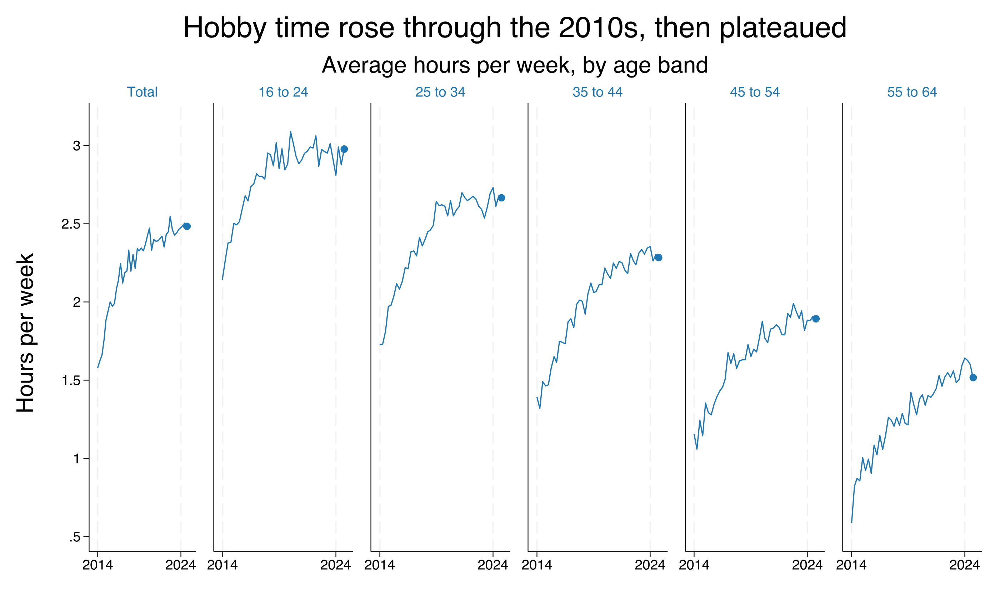

# panelline

A Stata command that draws a **small-multiples (faceted) line plot** in the style
of Financial Times time-series graphics: one time-series sub-plot per group, all
on a **shared y-axis** so trends are directly comparable, with an **end-point dot**
marking the most recent value of each line.



## Requirements

- Stata 16 or newer

## Installation

### Option A — `net install` (recommended)

```stata
net install panelline, from("https://raw.githubusercontent.com/ganma0517/stata_panelline/main/") replace
```

### Option B — `github install`

Requires the community `github` command (`ssc install github` once), then:

```stata
github install ganma0517/stata_panelline
```

After installing, read the help and run the example:

```stata
help panelline
do panelline_example.do
```

## Quick start

A practice dataset is included — **fictional** average weekly hours on a hobby by
age band, 2014–2024 (long format, no real-world source):

```stata
use "https://raw.githubusercontent.com/ganma0517/stata_panelline/main/panelline_demo.dta", clear
panelline hours, over(band) time(time) xlabel(2014 2024)
```

## Data format

Input is **long**: one row per panel-time.

| band | time | hours |
|---|---|---|
| Total   | 2014.0 | 1.52 |
| Total   | 2014.25| 1.61 |
| 16 to 24| 2014.0 | 2.05 |
| 16 to 24| 2014.25| 2.10 |

## Syntax

```
panelline yvar [if] [in], over(panelvar) time(timevar) [options]
```

| Option | Description | Default |
|---|---|---|
| `over(varname)` | panel variable (required) | — |
| `time(varname)` | x-axis time variable (required) | — |
| `cols(#)` | number of columns | auto |
| `lcolor()` `lwidth()` | line color / width | blue / medium |
| `noenddot` | hide the end-point dot | off |
| `dotcolor()` `dotsize()` | end-dot color / size | line color / medium |
| `noycommon` | per-panel y-axis (default: shared) | shared |
| `ylabel()` `xlabel()` | axis label rules (all panels) | — |
| `title()` `subtitle()` `ytitle()` | titles | — / — / var label |
| `saving()` `name()` | export / window name | — |

See `help panelline` for full documentation and examples.

## Files

- `panelline.ado` — the command
- `panelline.sthlp` — Stata help file
- `panelline_example.do` — runnable tutorial
- `panelline_demo.dta` — practice data (fictional, long format)
- `example_panelline.png` — demo figure
- `panelline.pkg`, `stata.toc` — package metadata for `net install`

## About the author

PhD in Political Science at National Chengchi University and a postdoctoral
research fellow at the Institute of Sociology, Academia Sinica. My research
focuses on political and social change in Taiwan and comparative politics, and I
use Claude to develop small Stata graphing tools that support empirical and
survey-experiment research. Questions welcome — beck740517@gmail.com

政治大學政治學系博士、中央研究院社會學研究所博士後研究員。研究聚焦台灣政治社會變遷與比較政治，
並使用 Claude 開發小型 Stata 製圖工具輔助實證與調查實驗研究。若有任何問題，歡迎寫信與我交流。

## Citation

Lin, Wen-Cheng (2026). *panelline: Small-multiples line plot with end-point dots.*
https://github.com/ganma0517/stata_panelline

## License

MIT — see [LICENSE](LICENSE).
